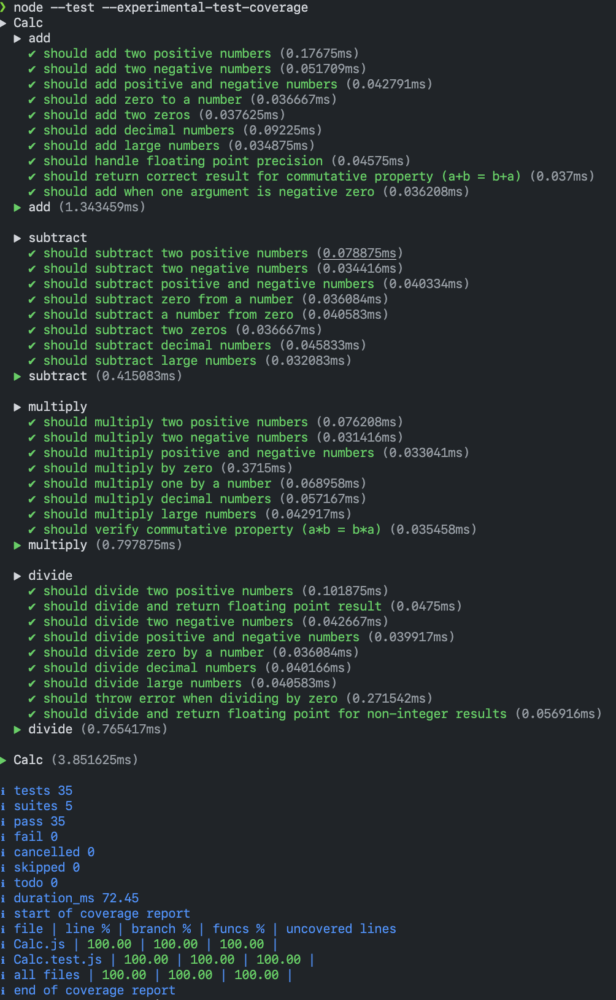

# Software Testing Homework 2: Test-Driven Development with Calc.js

## Quick Start

```bash
npm install    # Install dependencies
npm test       # Run all 35 tests
```

---

## Project Overview

Extended Calc.js with three new operations using Test-Driven Development (TDD):
- **Subtract** - 8 test cases
- **Multiply** - 8 test cases
- **Divide** - 9 test cases (with zero-check error handling)

Total: **35 tests**, all passing ✅

---

## Files

### Core Deliverables
- **[Calc.js](Calc.js)** - Final implementation (4 static methods)
- **[Calc.test.js](Calc.test.js)** - Test suite (35 comprehensive test cases)
- **[CONVERSATION_RECORD.md](CONVERSATION_RECORD.md)** - Complete project history and TDD narrative

### Configuration
- **package.json** - Project setup
- **[.github/workflows/ci.yml](.github/workflows/ci.yml)** - GitHub Actions CI/CD

---

## Implementation

```javascript
class Calc {
    static add(a, b) {
        return a + b;
    }

    static subtract(a, b) {
        return a - b;
    }

    static multiply(a, b) {
        return a * b;
    }

    static divide(a, b) {
        if (b === 0) {
            throw new Error('Division by zero is not allowed');
        }
        return a / b;
    }
}
```

**Features**:
- 22 lines of clean, minimal code
- Full support for integers and floating-point numbers
- Error handling for division by zero
- All operations pass 100% of test cases

---

## Test Results

```
# tests 35
# suites 5
# pass 35
# fail 0
# duration_ms ~60ms
```

### Test Breakdown
| Operation | Tests | Status |
|-----------|-------|--------|
| Add | 10 | ✅ Pass |
| Subtract | 8 | ✅ Pass |
| Multiply | 8 | ✅ Pass |
| Divide | 9 | ✅ Pass |

### Test Categories
- Basic operations (positive, negative, mixed signs)
- Edge cases (zero, decimals, large numbers)
- Mathematical properties (commutative property)
- Error handling (division by zero)
- Floating-point precision (±0.0001 tolerance)

---

## TDD Methodology

### Phase 1: Subtract
1. **Red**: 8 failing tests 
2. **Green**: Implement `subtract()` 
3. **Refactor**: Already optimal

### Phase 2: Multiply
1. **Red**: 8 failing tests 
2. **Green**: Implement `multiply()` 
3. **Refactor**: Already optimal

### Phase 3: Divide
1. **Red**: 9 failing tests 
2. **Green**: Implement `divide()` with error handling 
3. **Refactor**: Already optimal

### Test Results

```
node --test --experimental-test-coverage
```


See [test.dump](test.dump) for detailed test results.

You can also inspect the test results in the [GitHub Actions](https://github.com/Quisette/NYCU-Software-Testing-HW2/actions/) in this repo.


---

## Full Details

For complete project history, TDD process explanation, and all implementation details, see **[CONVERSATION_RECORD.md](CONVERSATION_RECORD.md)**
